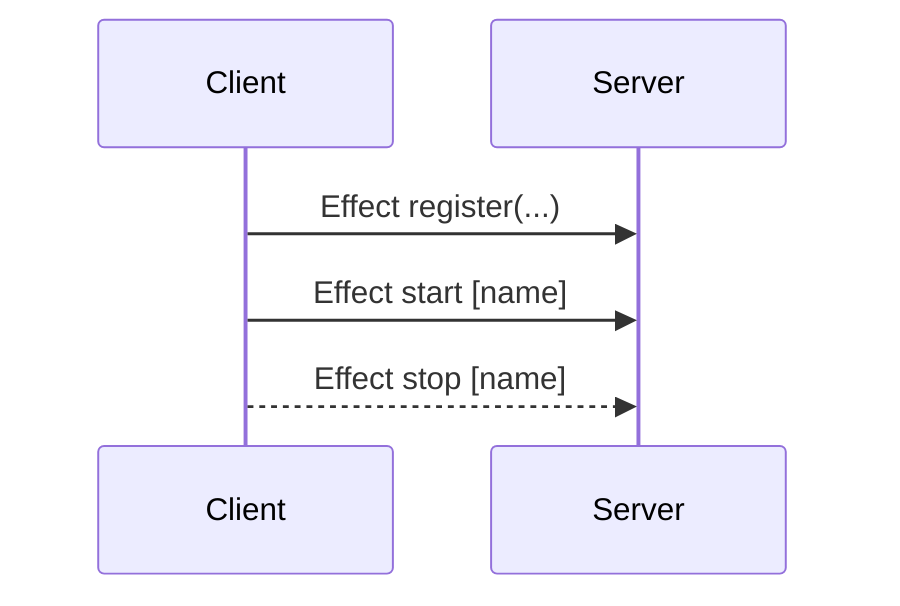
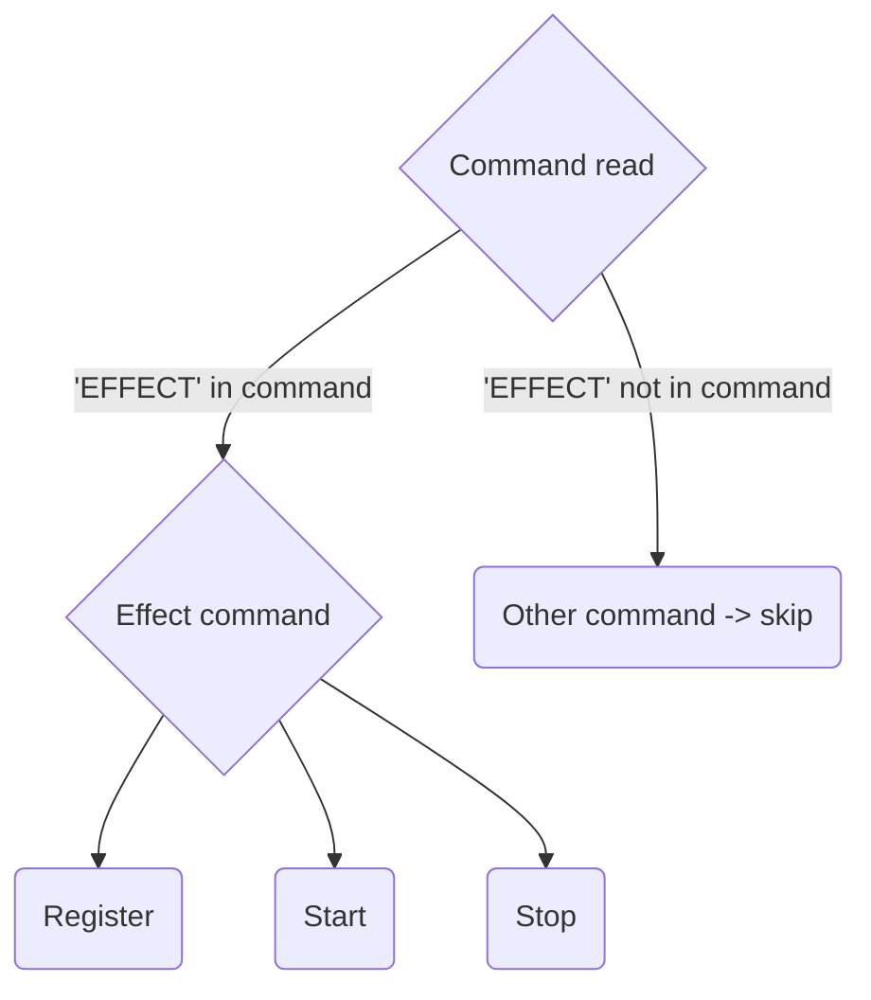

## Effects

You can use timed effects instead of custom DMX commands

### Communication

```mermaid
sequenceDiagram
Client ->> Server: Effect register(...)
Client ->> Server: Effect start [name]
Client -->> Server: Effect stop [name]
```
### Serverside Effect flowchart

```mermaid
graph TD
A{Command read} -- 'EFFECT' in command --> B{Effect command}
A -- 'EFFECT' not in command--> C(Other command -> skip)
B --> R(Register)
B --> S(Start)
B --> s(Stop)


```
